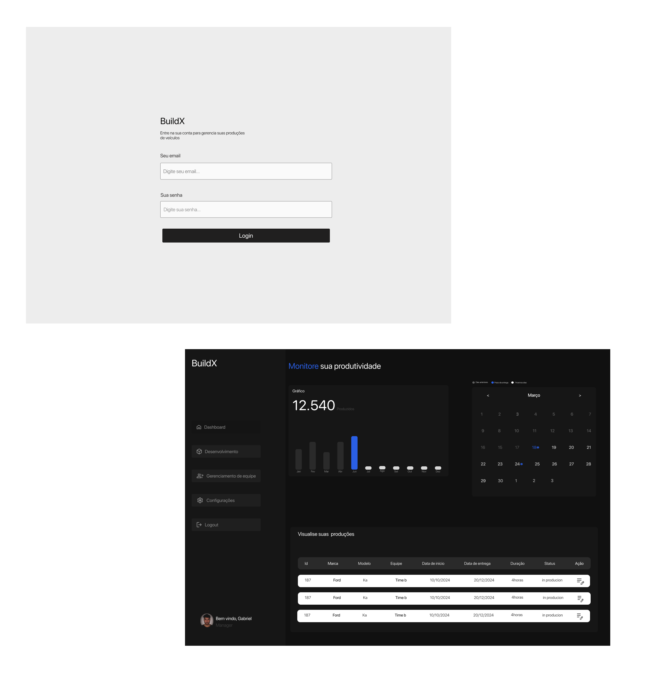

# BuildX

 

 

# Tarefas e bus pra resolver

- **(tarefa)** Criar condição para quantidade de produção do ano atual (sem a condição ela pega de todos os anos )
- **(tarefa)** Mensagem de sucesso após a ação:

  - Criar usuarios ✅
  - Deletar usuarios 🟡
  - Criar produção ❌
  - Excluir produção ❌

- **(Tarefa)** Mostrar as produções que estao em produção/conluida na data selecionada

- **(Bug)** Não esta mostrando mensagens de erro no login
  - Este email não existe
  - Senha incorreta
     

# Descrição

Estou desenvolvendo um sistema para monitorar a produtividade na criação de carros, utilizando React com TypeScript e Redux Toolkit para gerenciar o estado de forma eficiente. A aplicação é projetada para ser escalável e fácil de manter. No backend, estou utilizando Node.js para fornecer uma base robusta e flexível.

Para a interface, optei por Tailwind CSS, combinado com componentes reutilizáveis, garantindo um design limpo, personalizável e que facilite a manutenção e expansão do projeto. Além disso, integrei a Context API para gerenciar estados locais de maneira simples e eficiente dentro dos componentes

# Tecnologias utilizadas

- React Js + TypeScript

  - Redux Toolkit
  - Rtk Query
  - React Router
  - Content Api
  - Composition

- Tailwind
- Node Js
